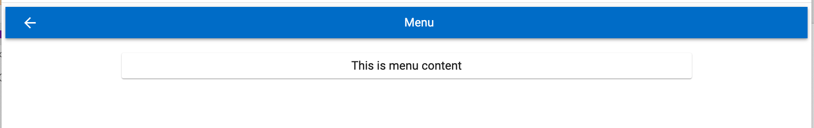

# Register Card App
 by **William Xie**

## **Scripts**

### - Startup the app locally

In the project directory **webapp**, run:\
`yarn`

Installs all dependencies.\
`yarn start`

Runs the app in the development mode.\
Open [http://localhost:3000](http://localhost:3000) to view it in the browser.

### - Run all tests

 `yarn test`

Launches the test runner in the interactive watch mode.

### - Build to production

`yarn build`

Builds the app for production to the `build` folder.\
&nbsp;

## **Features**
### - Screenshots
1. Regiser card form page - invalid

2. Regiser card form page - valid

3. Menu page - valid

### - Navigation
- [x] Click on burger icon shows menu
- [x] Click on back shows register card form 

### - Inputs
- [x] Credit card field is any number
- [x] CVC is any number
- [x] Expires is any valid date

### - Submit
- [x] You cannot submit until input fields
- [x] When submitting then console log the input values  
&nbsp;

## **Key** **points**
### - Tests
- jest
- react-testing-library
  
### - Clean Code
- DRY

### - State Management
- useContext
- useState
  
### - Design (Responsive)
- Material UI Grid
  
### - Accessibility
- WAI-ARIA
- color contrast

